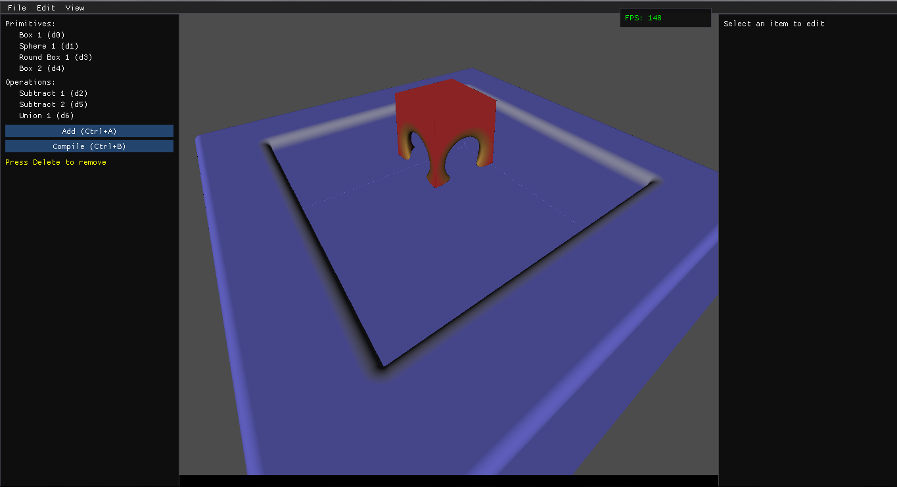
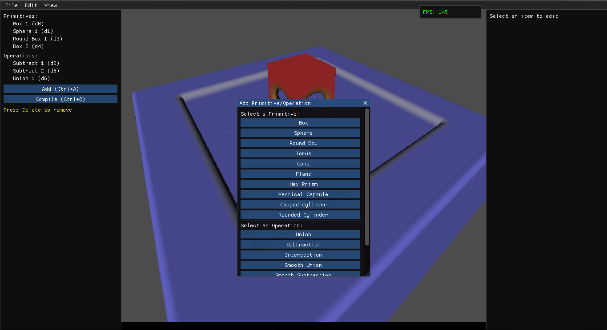
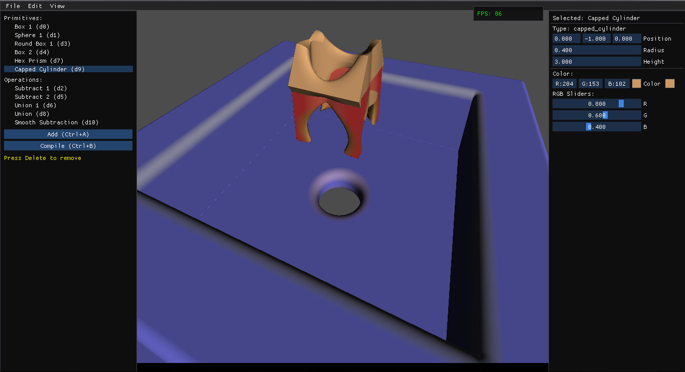
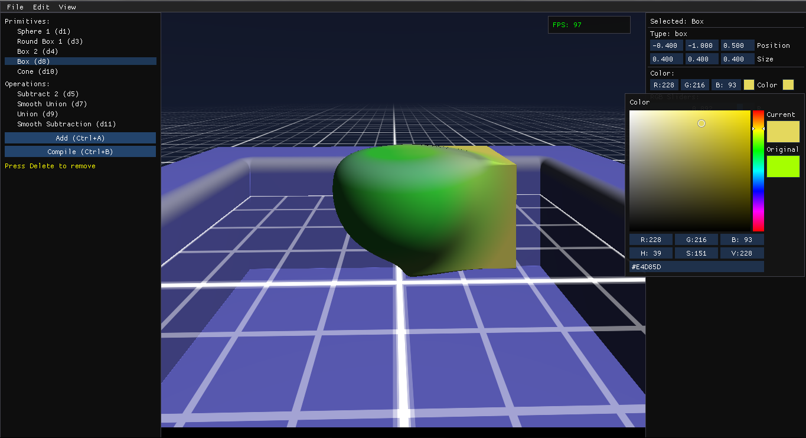

# **SDF Model Editor (Demo)**
*A lightweight editor for creating and manipulating Signed Distance Field (SDF) primitives using Python, GLSL, and OpenGL.*

[](https://www.python.org/downloads/release/python-380/)
[](LICENSE)
[](https://github.com/EmberNoGlow/SDF-Model-Editor-Demo/issues)
[](https://github.com/EmberNoGlow/SDF-Model-Editor-Demo/stargazers)

---

## **🌟 Overview**
This project is a **work-in-progress** editor for designing 3D models using **Signed Distance Fields (SDFs)**. Built with `Python`, `GLSL`, `ImGui`, `GLFW`, and `PyOpenGL`, it allows real-time rendering and interaction with SDF primitives.

While the current version is a **demo with limited functionality**, it serves as a foundation for a more powerful tool. The goal? To simplify 3D modeling by combining primitives into stylized characters or objects—**no sculpting required!**

> *I’m happy with the result, but there’s so much more to build!*

---

## **📌 Screenshots**
|  |  |
|:--------------------------------------------:|:--------------------------------------------:|
|  |  |

---

## **⚠️ Current Status**
This is an **early-stage prototype** with known bugs and missing features. Check the **[Roadmap](#-roadmap)** for planned improvements.

### **Known Issues**
- Cone and Plane have duplicate parameters.
- Screen shifts when adjusting rendering scale.
- Minor UI/UX inconsistencies.

> **Your feedback and contributions are welcome!** Open an [issue](https://github.com/EmberNoGlow/SDF-Model-Editor-Demo/issues) or submit a [PR](https://github.com/EmberNoGlow/SDF-Model-Editor-Demo/pulls).

---

## **🚀 Features**
✅ **Real-time SDF rendering** (GLSL shaders)

✅ **Smooth logic operations** (substract, intersect, union, etc.)

✅ **Multi-primitive composition** (spheres, boxes, cones, etc.)

✅ **ImGui-based UI** for intuitive controls

---

## **🎯 Roadmap**

### *Current Progress*
- **📜 Save/Load** - Implemented, testing!
- **📝 Creating a gizmo** - Preparation

### **Core Functionality (MVP Goals)**
- [x] **Free movement of the camera in 3d space** - Done!
- [x] **Translation operations for primitives** - rotation, scale, and position - can be changed in real time in the inspector.
- [ ] **Save/Load projects** (JSON or custom format)
- [ ] **Export to 3D formats** (OBJ, GLTF) via voxelization/marching cubes
- [ ] **Gizmo-based manipulation** (drag, rotate, scale primitives)
- [ ] **Undo/Redo support**

### **User Experience (Future Improvements)**
- [ ] **Themes & customization**
- [ ] **Localization (i18n)**
- [ ] **Performance optimizations**

---

## **💞 Contributing**
Contributions are **highly encouraged**! Here’s how you can help:
1. **Report bugs** → Open an [issue](https://github.com/EmberNoGlow/SDF-Model-Editor-Demo/issues).
2. **Suggest features** → Share your ideas in [Discussions](https://github.com/EmberNoGlow/SDF-Model-Editor-Demo/discussions/).
3. **Submit code** → Fork the repo and create a [Pull Request](https://github.com/EmberNoGlow/SDF-Model-Editor-Demo/pulls).

> **Note:** This project is a learning experience—expect refactoring and experimentation!

---

## **💡 The Story Behind This Project**
### **Inspiration**
It all started with [this article](https://iquilezles.org/articles/smin/) on SDF-based modeling. The idea of creating stylized 3D characters with just **10-20 primitives** was too exciting to ignore!

### **The Journey**
- **Phase 1:** Built an MVP using AI tools (ChatGPT, Copilot, Cursor).
- **Phase 2:** Hit limitations - free chat limits, code complexity, and bugs.
- **Phase 3:** Spent **2 months** refactoring, learning, and improving.

> *AI isn’t a magic solution—it’s a tool. The real work is in understanding and refining the code.*

### **Lessons Learned**
✔ **AI accelerates prototyping** but requires deep debugging.

✔ **Refactoring is part of the process**—embrace it!

✔ **Small steps lead to big results**—this is just the beginning.

---

## **🔗 Resources**
- [SDF Wikipedia](https://en.wikipedia.org/wiki/Signed_distance_function)
- [Inigo Quilez’s SDF Functions](https://iquilezles.org/articles/distfunctions/)
- [Shadertoy](https://www.shadertoy.com/) (for SDF inspiration)
- [Cursor AI](https://cursor.com/) (the AI assistant that helped)

---

## **📜 License**
This project is licensed under the **MIT License** – see [LICENSE](LICENSE) for details.

---

## **🙌 Acknowledgments**
- **Inigo Quilez** for SDF research.
- **AI tools** (ChatGPT, Copilot, Cursor) for assistance.
- **Open-source community** for inspiration and libraries.

---

### **🚀 Ready to Try It?**
```bash
git clone https://github.com/EmberNoGlow/SDF-Model-Editor-Demo.git
cd sdf-model-editor
pip install -r requirements.txt
python main.py
```

---

### **Final Thoughts**
This project is a **testament to experimentation**—imperfect, evolving, but full of potential. Whether you’re here to **learn, contribute, or build**, I’m excited to see where it goes next!

**Let’s create something amazing together.** 🚀

---

## Support

Your support helps development! Help by leaving a review, reporting an error, suggesting an idea in Discussions, creating a Pull Request, or just **star ⭐** the repository!.

Follow me: **[Bluesky](https://bsky.app/profile/embernoglow.bsky.social)** | **[dev.to](https://dev.to/embernoglow)**
