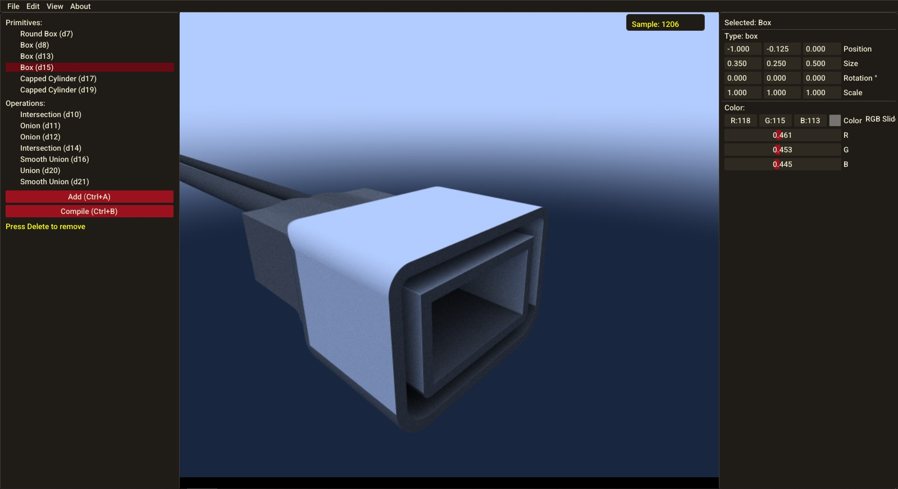
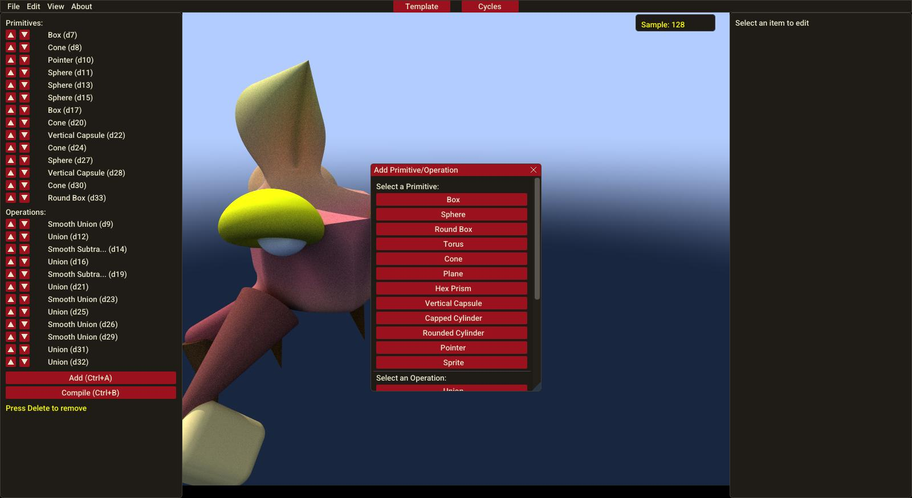
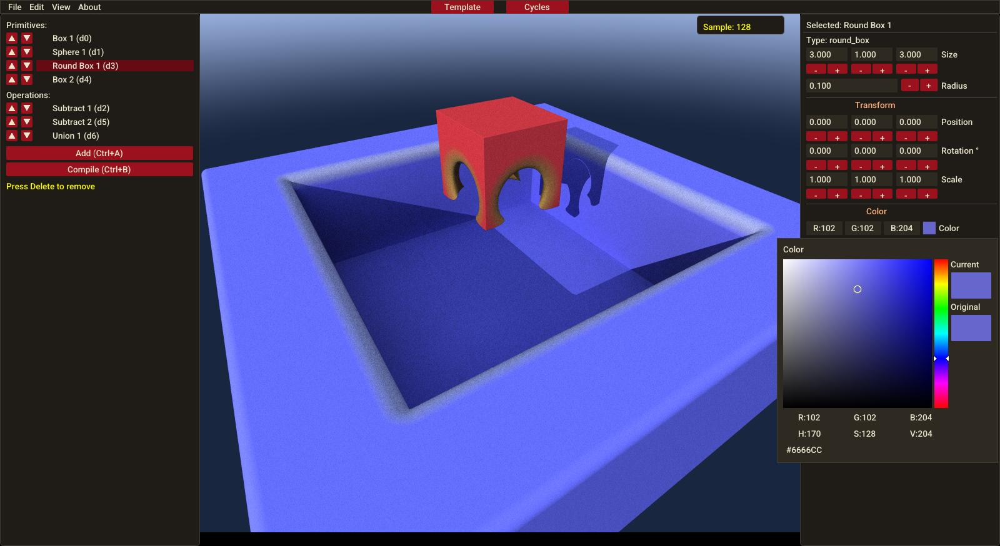
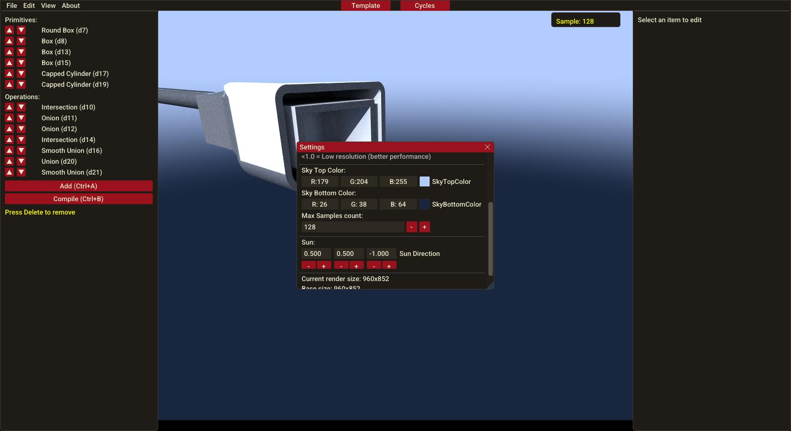
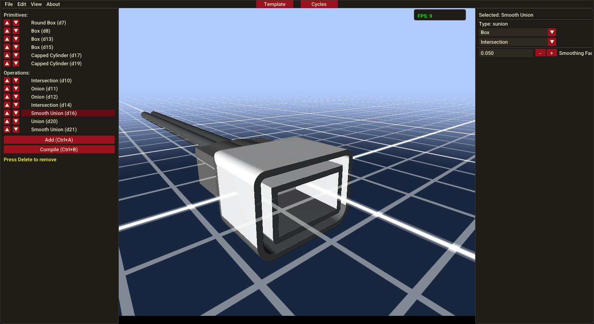
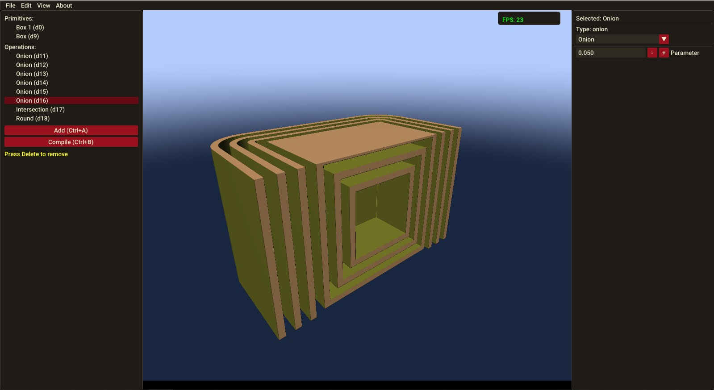

# **SDF Model Editor (Demo)**
*A lightweight editor for creating and manipulating Signed Distance Field (SDF) primitives using Python, GLSL, and OpenGL.*


[](https://www.python.org/downloads/release/python-3110/) [](https://www.khronos.org/registry/OpenGL/index_gl.php) [](https://github.com/pyimgui/pyimgui) [](https://www.glfw.org/) [](LICENSE) [](https://github.com/EmberNoGlow/SDF-Model-Editor-Demo/issues) [](https://github.com/EmberNoGlow/SDF-Model-Editor-Demo/stargazers)

---

## **🌟 Overview**
This project is a **work-in-progress** editor for designing 3D models using **Signed Distance Fields (SDFs)**. Built with `Python`, `GLSL`, `ImGui`, `GLFW`, and `PyOpenGL`, it allows real-time rendering and interaction with SDF primitives.

While the current version is a **demo with limited functionality**, it serves as a foundation for a more powerful tool. The goal? To simplify 3D modeling by combining primitives into stylized characters or objects—**no sculpting required!**

> *I’m happy with the result, but there’s so much more to build!*

---

## **📌 Screenshots**
|  |  | 
|:--------------------------------------------:|:--------------------------------------------:|:--------------------------------------------:|
|  |  | 

---

## **⚠️ Current Status**
This is an **early-stage prototype** with known bugs and missing features. Check the **[Roadmap](#-roadmap)** for planned improvements.

### **Known Issues**
- Redo/Undo bugs
- Small bugs


> **Your feedback and contributions are welcome!** Open an [issue](https://github.com/EmberNoGlow/SDF-Model-Editor-Demo/issues) or submit a [PR](https://github.com/EmberNoGlow/SDF-Model-Editor-Demo/pulls).

---

## **🚀 Features**
✅ **Real-time SDF rendering** (GLSL shaders)

✅ **Cycles Additional rendering mode - Realistic Ray Tracing algorithm**

✅ **Smooth logic operations** (substract, intersect, union, etc.)

✅ **Multi-primitive composition** (spheres, boxes, cones, etc.)

✅ **ImGui-based UI** for intuitive controls

✅ **Save & Load** functions (using tkinter)

---

## **🎯 Roadmap**

### *Current Progress*
- **🐜 Fix Undo/Redo** bugs
- **〽 Found and Fix** bugs
- **⏱ Optimize**
- **🧷 Integrate [marching cubes](https://github.com/EmberNoGlow/Rust-Marching-Cubes-Generator) written in Rust** for export into 3D format (example, obj)
- **📝 Creating a gizmo** - Preparation

### **Core Functionality (MVP Goals)**
- [x] **Free movement of the camera in 3d space** - Done!
- [x] **Translation operations for primitives** - rotation, scale, and position - can be changed in real time in the inspector.
- [x] **Save/Load projects** (JSON or custom format)
- [x] **Undo/Redo support**
- [ ] **Export to 3D formats** (OBJ, GLTF) via voxelization/[marching cubes](https://github.com/EmberNoGlow/Rust-Marching-Cubes-Generator)
- [ ] **Gizmo-based manipulation** (drag, rotate, scale primitives)
- [ ] **Add AABB** - optimization
- [ ] **Write Docs!**

### **User Experience (Future Improvements)**
- [ ] **Themes & customization**
- [ ] **Localization (i18n)**
- [ ] **Performance optimizations**

---

## **💞 Contributing**
Contributions are **highly encouraged**! Here’s how you can help:
1. **Report bugs** → Open an [issue](https://github.com/EmberNoGlow/SDF-Model-Editor-Demo/issues).
2. **Suggest features** → Share your ideas in [Discussions](https://github.com/EmberNoGlow/SDF-Model-Editor-Demo/discussions/).
3. **Submit code** → Fork the repo and create a [Pull Request](https://github.com/EmberNoGlow/SDF-Model-Editor-Demo/pulls).

> **Note:** This project is a learning experience - expect refactoring and experimentation!

---

## **💡 The Story Behind This Project**
### **Inspiration**
It all started with [this article](https://iquilezles.org/articles/smin/) on SDF-based modeling. The idea of creating stylized 3D characters with just **10-20 primitives** was too exciting to ignore!

### **The Journey**
- **Phase 1:** Built an MVP using AI tools (ChatGPT, Copilot, Cursor).
- **Phase 2:** Hit limitations - free chat limits, code complexity, and bugs.
- **Phase 3:** Spent **2 months** refactoring, learning, and improving.

> *AI isn’t a magic solution—it’s a tool. The real work is in understanding and refining the code.*

### **Lessons Learned**
✔ **AI accelerates prototyping** but requires deep debugging.

✔ **Refactoring is part of the process**—embrace it!

✔ **Small steps lead to big results**—this is just the beginning.

---

## **🔗 Resources**
- [SDF Wikipedia](https://en.wikipedia.org/wiki/Signed_distance_function)
- [Inigo Quilez’s SDF Functions](https://iquilezles.org/articles/distfunctions/)
- [Shadertoy](https://www.shadertoy.com/) (for SDF inspiration)
- [Cursor AI](https://cursor.com/) (the AI assistant that helped)

---

## **📜 License**
This project is licensed under the **MIT License** – see [LICENSE](LICENSE) for details.

---

## **🙌 Acknowledgments**
- **Inigo Quilez** for SDF research.
- **AI tools** (ChatGPT, Copilot, Cursor) for assistance.
- **Open-source community** for inspiration and libraries.

---

## **🚀 Ready to Try It?**
### Download compiled
Compiled executables for windows can be **found in [releases](https://github.com/EmberNoGlow/SDF-Model-Editor-Demo/releases)**


> *NOTE*: I don't have the ability to compile a linux app yet.


### Clone and run main.py
```bash
git clone https://github.com/EmberNoGlow/SDF-Model-Editor-Demo.git
cd SDF-Model-Editor-Demo
python -m venv .venv
.venv/Scripts/Activate.ps1
pip install -r requirements.txt
python main.py
```

> *NOTE:* To install the imgui package you will need a c++ compiler. My advice is to use **[mingw](https://sourceforge.net/projects/mingw/)** - if you **only** need a compiler for this task. **[Build Tools](https://visualstudio.microsoft.com/downloads/?q=build+tools)** will do for this task too, but it **weighs more**.


### Compilation

1. **First, install pyinstaller.**

```bash
pip install pyinstaller
```

2. **Compile into one file**

```bash
pyinstaller --onefile --name sdfeditor --windowed --add-binary ".venv\Lib\site-packages\glfw\glfw3.dll;." main.py
```

> *NOTE*: You should make sure that you have a virtual environment named **.venv created and glfw installed** (it is added to requirements). If there is none or the **path is incorrect, specify the correct path** to `the glfw3.dll` file located in the virtual environment in the `\Lib\site-packages\glfw folder`!

3. **Move the compiled file to a separate folder and drag the shaders folder to this directory. You should get it like this:**

```

root directory
├── shaders
│    ├── fragment
│    │    ├── cycles.glsl
│    │    └── template.glsl
│    │
│    ├── sdf_library.glsl
│    └── vertex_shader.glsl
│
├── glfw3.dll
└── sdfeditor.exe

```


---

### **Final Thoughts**
This project is a **testament to experimentation** - imperfect, evolving, but full of potential. Whether you’re here to **learn, contribute, or build**, I’m excited to see where it goes next!

**Let’s create something amazing together.** 🚀

---

## Support

Your support helps development! Help by leaving a review, reporting an error, suggesting an idea in Discussions, creating a Pull Request, or just **star ⭐** the repository!.


## Follow me

<a href="https://dev.to/embernoglow" target="_blank"></a><a href="https://bsky.app/profile/embernoglow.bsky.social" target="_blank"></a><a href="https://github.com/EmberNoGlow" target="_blank"></a>
