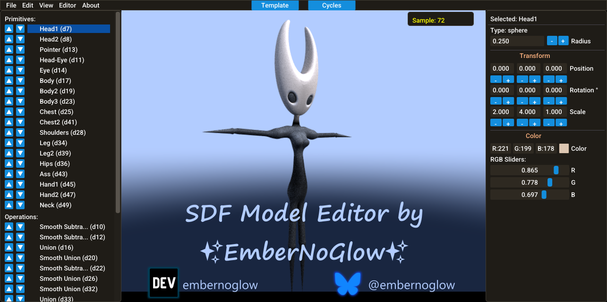
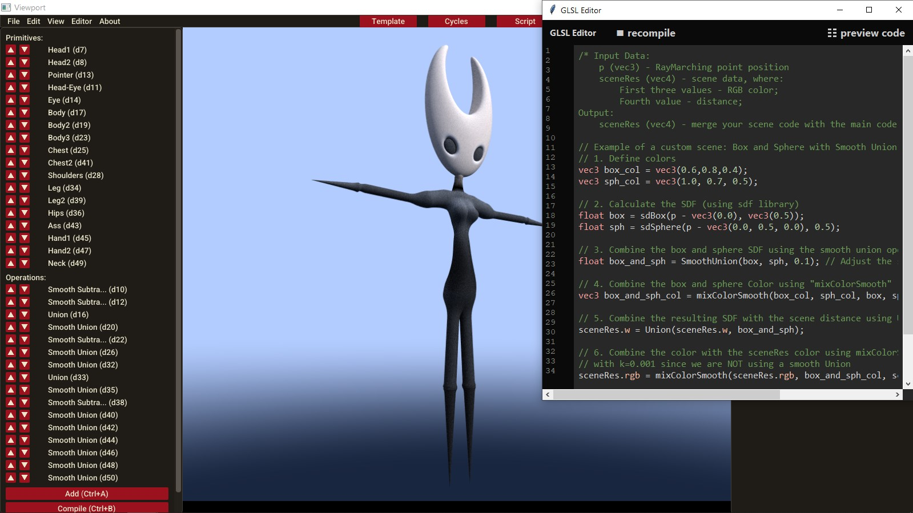
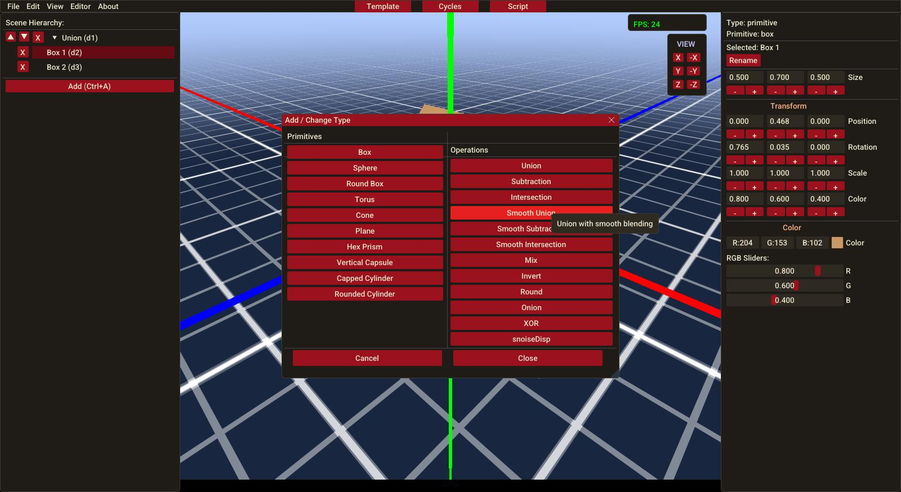
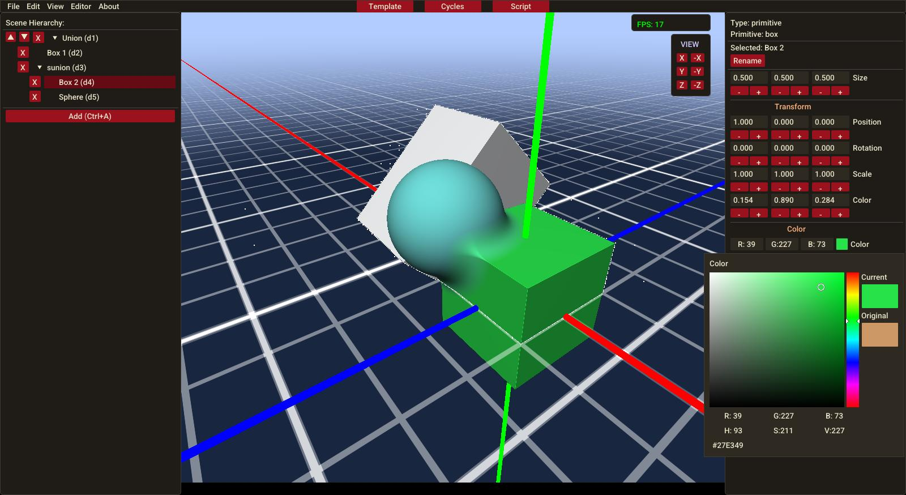
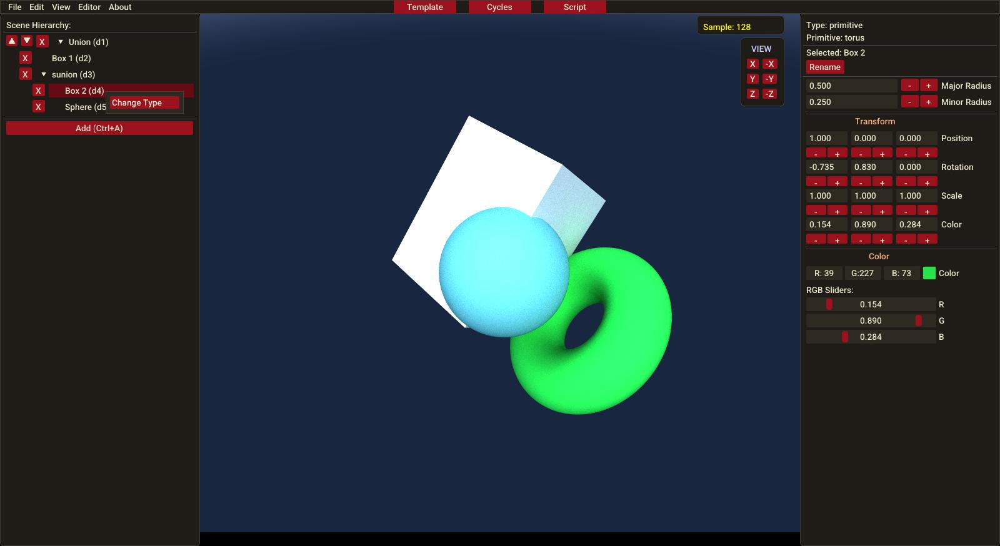
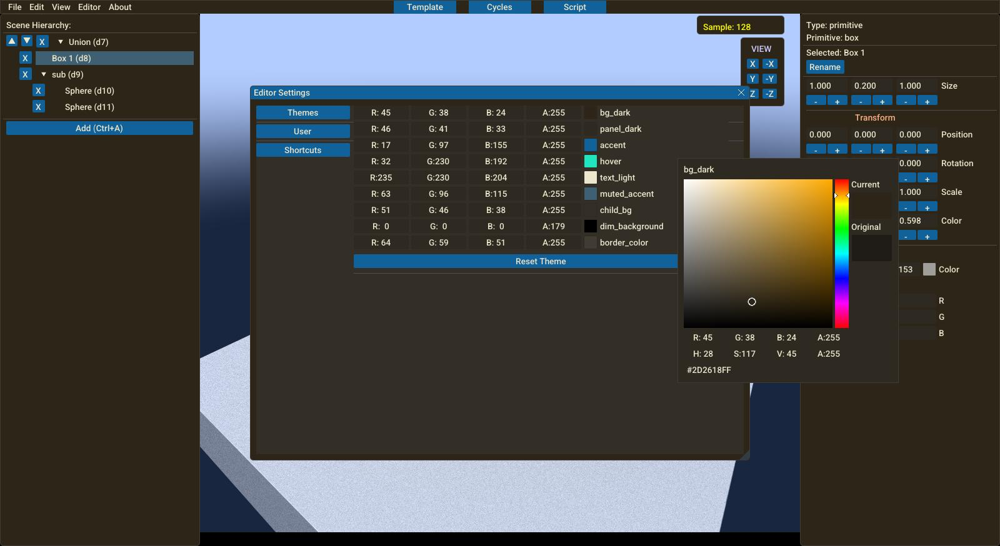
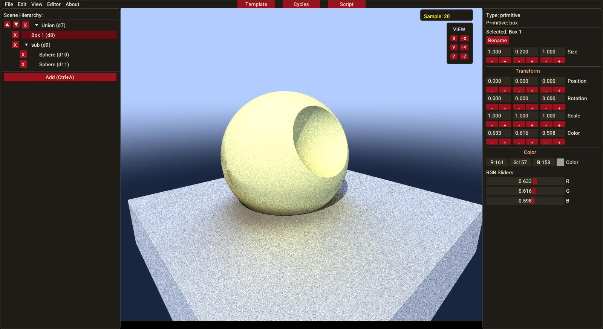

# **SDF Model Editor (Demo)**
*A lightweight editor for creating and manipulating Signed Distance Field (SDF) primitives using Python, GLSL, and OpenGL.*


[](https://www.python.org/downloads/release/python-3110/) [](https://www.khronos.org/registry/OpenGL/index_gl.php) [](https://github.com/pyimgui/pyimgui) [](https://www.glfw.org/) [](LICENSE) [](https://github.com/EmberNoGlow/SDF-Model-Editor-Demo/issues) [](https://github.com/EmberNoGlow/SDF-Model-Editor-Demo/stargazers)

---



---


## **🌟 Overview**
**SDF Model Editor** is an experimental, real‑time tool for designing 3D models using **Signed Distance Fields (SDFs)**. Built with **Python**, **GLSL**, **ImGui**, **GLFW**, and **PyOpenGL**, it provides an accessible environment for exploring procedural modeling techniques without the complexity of traditional sculpting workflows.

The current version is a **functional demo** and a foundation for a more complete editor. The long‑term vision is to make SDF‑based modeling intuitive, playful, and powerful — enabling users to build stylized characters and objects from simple primitives.

---

## **📌 Screenshots**
|  |  | 
|:--------------------------------------------:|:--------------------------------------------:|:--------------------------------------------:|
|  |  | 

---

## 🚀 Features

- **Real‑time SDF rendering** using GLSL shaders  
- **Cycles Additional rendering mode** (realistic ray‑tracing algorithm)  
- **Smooth boolean operations** (union, subtract, intersect, etc.)  
- **Multiple primitive types** (sphere, box, cone, and more)  
- **ImGui‑based UI** for intuitive interaction  
- **Save & Load** scenes (JSON)  
- **Export to 3D formats** (OBJ via scikit‑image)  
- **Built‑in GLSL code editor** (Tkinter)  
- **Undo/Redo** support  

## 🧭 Project Status

This project is in **late‑stage prototype** development. The MVP is nearing completion, and the next phase will focus on expanding functionality, improving UX, and preparing for a broader public release.

Your feedback, ideas, and contributions can meaningfully shape the direction of the full editor.

---

## 🎯 Roadmap

### **Current Work**
- 📝 Customization  
- 🧷 UX improvements  
- 🐛 Bug fixes  
- 🔨 GLSL code editor  
- 🌐 Localization groundwork  

### **MVP Goals**
- [x] Free camera movement  
- [x] Real‑time transform controls (position, rotation, scale)  
- [x] Save/Load (JSON)  
- [x] Undo/Redo  
- [x] OBJ export  
- [ ] Gizmo‑based manipulation  
- [ ] Documentation  

### **Future Improvements**
- [x] Themes  
- [ ] Full customization  
- [ ] Localization (i18n)  
- [ ] Performance optimizations  

---

## 💞 Contributing

Contributions are **warmly welcomed** — whether you're fixing bugs, proposing features, or exploring SDFs for the first time.

You can help by:

1. Reporting issues → [Issues](https://github.com/EmberNoGlow/SDF-Model-Editor-Demo/issues)  
2. Suggesting features → [Discussions](https://github.com/EmberNoGlow/SDF-Model-Editor-Demo/discussions)  
3. Submitting code → [Pull Requests](https://github.com/EmberNoGlow/SDF-Model-Editor-Demo/pulls)  
4. Reaching out directly → **[DM on Bluesky](https://bsky.app/profile/embernoglow.bsky.social)**  

---


## 🛠 Installation
### **Download (Windows)**  
Pre‑built executables are available in **[Releases](https://github.com/EmberNoGlow/SDF-Model-Editor-Demo/releases)**

> Linux builds are not yet supported.


---

### **Run from Source**

```bash
git clone https://github.com/EmberNoGlow/SDF-Model-Editor-Demo.git
cd SDF-Model-Editor-Demo
python -m venv .venv
.venv/Scripts/Activate.ps1
pip install -r requirements.txt
python main.py
```

> Installing `imgui` requires a C++ compiler.  
> Recommended: **[mingw]((https://sourceforge.net/projects/mingw/))** or **Visual Studio [Build Tools](https://visualstudio.microsoft.com/downloads/?q=build+tools)**.


---

## 🏗 Compilation

### **Automatic (Recommended)**

1. Navigate to the project directory  
2. Run:  
   ```
   .\build.ps1
   ```
3. After message "*BUILD COMPLETED SUCCESSFULLY!*", the executable will appear in `ReleaseBuild` folder.

---

### **Manual**

1. Install PyInstaller  
   ```bash
   pip install pyinstaller
   ```
2. Build  
   ```bash
   pyinstaller --onedir --name sdfeditor --windowed main.py
   ```
3. Move the executable and required folders (`shaders`, fonts, `glfw3.dll`) into a single directory:

```

root directory
├── assets/fonts
│    └── *.ttf files
│
├── shaders
│    ├── fragment
│    │    ├── cycles.glsl
│    │    └── template.glsl
│    │
│    ├── sdf_library.glsl
│    └── vertex_shader.glsl
│
├── glfw3.dll
└── sdfeditor.exe

```


---


## 💡 Inspiration & Background

This project began after exploring Inigo Quilez’s work on SDFs, especially the article on smooth minimum functions. The idea of building expressive 3D characters from just **10–20 primitives** was too compelling to ignore.

### Development Journey
- **Phase 1:** Rapid prototyping with AI tools.  
- **Phase 2:** Hitting limitations — complexity, bugs, and tool constraints.  
- **Phase 3:** Two months of refactoring, learning, and rebuilding.  

### Lessons Learned
- AI accelerates prototyping, but **understanding the code matters**.  
- Refactoring is not a setback — it’s part of the craft.  
- Small, consistent progress leads to real breakthroughs.  

---

## **🔗 Resources**
- [SDF Wikipedia](https://en.wikipedia.org/wiki/Signed_distance_function)
- [Inigo Quilez’s SDF Functions](https://iquilezles.org/articles/distfunctions/)
- [Shadertoy](https://www.shadertoy.com/) (for SDF inspiration)
- [Cursor AI](https://cursor.com/) (the AI assistant that helped)

---

## **📜 License**
This project is licensed under the **MIT License** – see [LICENSE](LICENSE) for details.

---

## **🙌 Acknowledgments**
- **Inigo Quilez** for best articles about math, sdf, computer graphics, etc.
- **AI tools** (ChatGPT, Copilot, Cursor) for assistance.
- **Open-source community** for inspiration and libraries.

---

## 🚀 Final Thoughts

This project is an evolving experiment — imperfect, ambitious, and full of potential. Whether you're here to learn, contribute, or build something new, I’m excited to see where this journey leads.

**Let’s create something amazing.**

---

## ⭐ Support the Project

You can help by:

- Starring the repo  
- Reporting bugs  
- Suggesting ideas  
- Sharing the project  

Every bit of support helps the editor grow.


## Follow me

<a href="https://dev.to/embernoglow" target="_blank"></a><a href="https://bsky.app/profile/embernoglow.bsky.social" target="_blank"></a><a href="https://github.com/EmberNoGlow" target="_blank"></a>